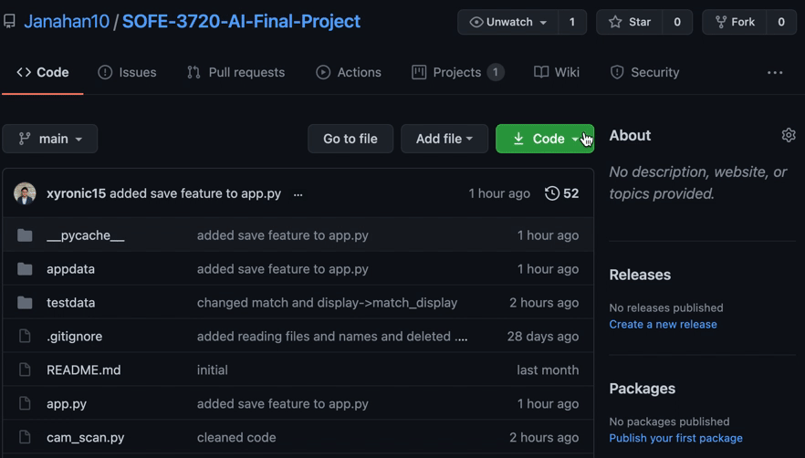

# Initial Setup

- Install Python3 from [here](https://www.python.org/downloads/)\n

- Run command `git clone https://github.com/Janahan10/SOFE-3720-AI-Final-Project.git`\n

- Or download project from Github website\n

# How to Run Program

- Navigate inside the project folder\n

- Install dependancies with `pip3 install -r requirements.txt`\n

- Run main program with `python3 app.py`\n

